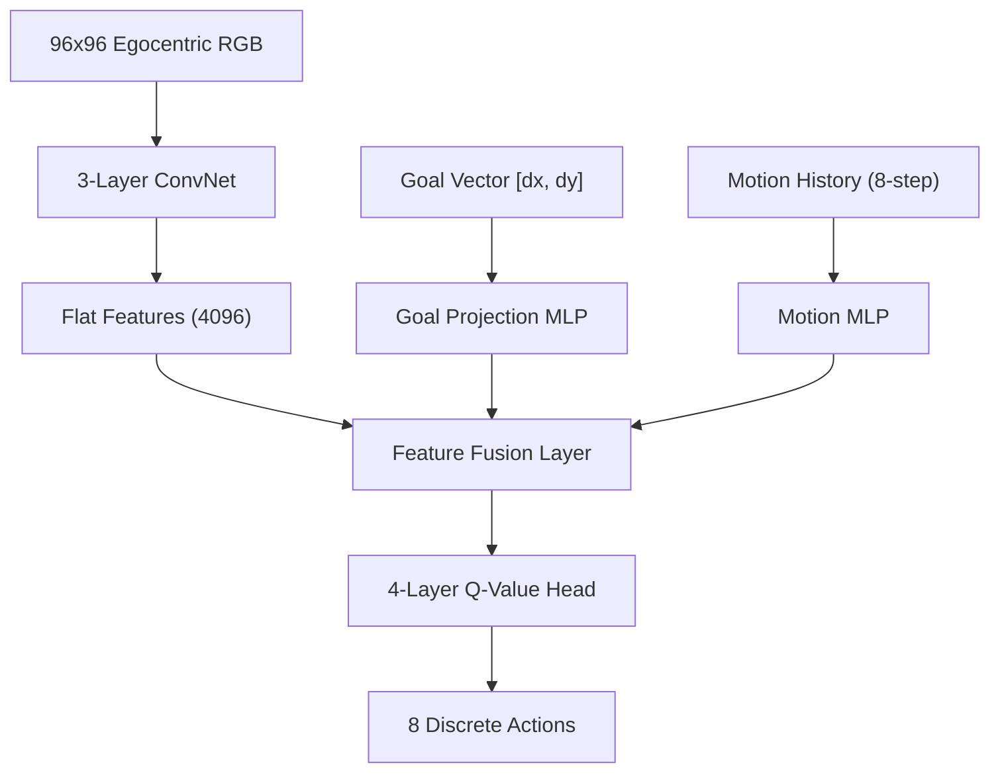

# Homebot Route Planner: Algorithmic Architecture & Lessons from the Frontier

This document outlines the architectural decisions, algorithmic designs, and empirical lessons learned during the development of the egocentric route planner for the `Homebot2D` robot. It serves as both a high-level explainer and a technical reference for future agents and developers.

---

## 1. Problem Formulation: Chained Egocentric Navigation

The target task is a multi-step household chore chain:
$$\text{Collect Trash} \rightarrow \text{Go to Fridge} \rightarrow \text{Go to Human} \rightarrow \text{Go to Door} \rightarrow \text{Go to Human}$$

### The Challenges
*   **Partial Observability (POMDP)**: The robot operates from a first-person, egocentric camera view ($96 \times 96$ RGB). It cannot see behind itself or around corners.
*   **Sparse Rewards**: The environment provides a sparse binary reward ($+1.0$ upon reaching a tight $31\text{px}$ target radius around the goal, $0.0$ otherwise).
*   **Wobble and Limit Cycles**: In discrete action spaces, egocentric policies are highly prone to high-frequency camera oscillations (jittering between diagonal views) and moving limit cycles (spinning/circling near obstacles).

---

## 2. Core Algorithmic Architecture

We solve this using a goal-conditioned Deep Q-Network (DQN) with several critical structural modifications.

### A. State Representation & POMDP Resolution
To resolve the partial observability of the egocentric view, the state is composed of three modalities:
1.  **Visual Features**: The current $96 \times 96$ RGB frame processed through a 3-layer Convolutional Neural Network.
2.  **Goal Vector**: An absolute displacement vector $[r_x, r_y, g_x, g_y]$ indicating the robot's coordinates and the target goal coordinates.
3.  **Motion History (The Memory Window)**: An 8-step history vector tracking the last 8 actions and net displacements. This history acts as a non-recurrent memory state, giving the network temporal context to break front-to-back wall-stuck oscillations.

### B. Action Space & Low-Pass Control (Frame Skipping)
The robot operates in an 8-directional discrete action space (N, NE, E, SE, S, SW, W, NW). 

*   **The 2-Step Frame Skip (The Champion)**: The policy repeats its chosen action for $2$ environment steps (moving $8\text{px}$ per agent step instead of $4\text{px}$). 
    *   **The Physics**: This acts as a low-pass control filter, preventing the Q-network from alternating actions at every single environment step.
    *   **The Result**: It cut the egocentric camera spin/wobble fraction from **27% to 7%**, smoothed the visual trajectory, doubled training speed, and achieved a **100% full-chain success rate** during training.

---

## 3. Goal Conditioning & Hindsight Experience Replay (HER)

To generalize navigation across the entire house, we train the policy as a **General Navigator** rather than specializing it on fixed coordinates.

### A. Generalization via Random Goal Tiles
During training, the desired goal is not the door or the fridge. Instead, we set `random_goal_tiles = True`, sampling a random valid floor tile across the entire map for every episode. The robot must learn the global navigation manifold of the house.

### B. The Specialization Dilemma & HER Annealing
Goal-conditioned RL relies on **Hindsight Experience Replay (HER)** to combat sparse rewards. For every rollout, we relabel transitions with goals that the robot actually achieved.

*   **The Collapse of Constant $K=4$**: Setting a high hindsight rate of $K=4$ (80% of the replay buffer is relabeled data) for the entire run causes **policy collapse**. The network overfits to reaching arbitrary local coordinates and fails to specialize in the long-range paths required for the final sparse target coordinates (the door/fridge).
*   **The Annealing Solution**: To reap the benefits of dense spatial learning without suffering from policy collapse, we use an **annealing curriculum** (`her_anneal_start`):
    *   **Bootstrap Phase (Episodes 0 – $T_\text{anneal}$)**: Train with a high hindsight rate ($K=4$) to rapidly map the global obstacle geometry of the house.
    *   **Specialization Phase (Episodes $T_\text{anneal}$ – $T_\text{max}$)**: Gradually anneal $K$ from $4$ down to $0$. This shifts the replay buffer's inflow to 100% real desired goals, forcing the policy to lock onto and specialize in the exact coordinates of the deployment chain.
    *   *Empirical Note*: Because the policy reaches peak general capability early, starting the annealing at **episode 400** (out of 1800) is optimal to prevent the onset of late-stage regression.

---

## 4. The Failed Frontier: Cardinal-Only Action Space

To eliminate the diagonal camera wobbling, we experimented with restricting the action space to the 4 cardinal directions (N, E, S, W), completely disabling diagonal movement.

*   **Why it Failed**: The robot lost the ability to **slide diagonally along walls**. When encountering a diagonal wall or fixture, a 4-action robot is forced to alternate cardinal moves (e.g., North $\rightarrow$ East $\rightarrow$ North). This caused the robot to collide head-on with the wall on every other step, triggering constant `-0.10` blocked penalties, getting stuck in corners, and timing out. The full-chain success rate dropped to **0%**.
*   **Lesson**: Do not restrict the physical action space to cardinal-only. Smoothness must be achieved via control filtering (Frame Skipping) rather than restricting the degrees of freedom.

---

## 5. Evaluation & Quality Control Metrics

We deploy three metrics to evaluate the policy's visual and functional quality:

### A. Multi-Step Chained Score
The deployment agent is evaluated on the full 5-leg sequence. The score is the average number of legs successfully completed (out of 5.0).

### B. Spin Fraction Metric
To mathematically measure "spinning" (limit cycles where the robot moves but makes no net progress), we track the ratio of steps where the robot's net displacement over a sliding window is below a threshold ($0.25$ times the maximum possible displacement):
$$\text{Spin Fraction} = \frac{\sum_{t} \mathbb{I}(\text{Net Displacement}_t < \epsilon)}{\text{Total Steps}}$$
A high-quality policy must maintain a spin fraction below **10%**.

### C. Best Checkpoint Selection with Tie-Breakers
To protect against late-stage policy regression, we save a running `q_model_best.pt`.
1.  **Primary Criterion**: Highest `chain_score`.
2.  **Secondary Criterion (Tie-Breaker)**: If scores are equal, we save the new checkpoint **only if** its `chain_spin_fraction` is strictly lower. This ensures the checkpoint selection actively optimizes for visual smoothness.
